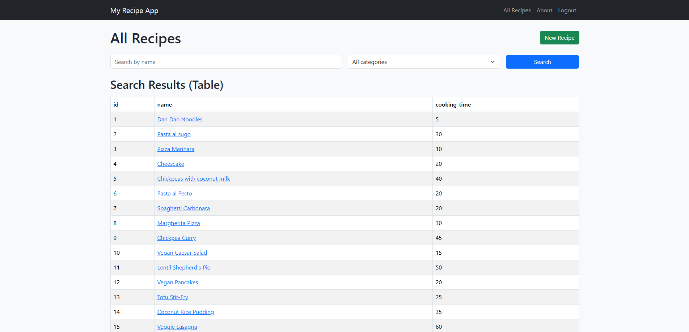
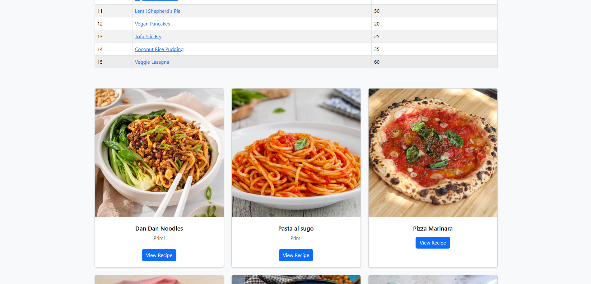
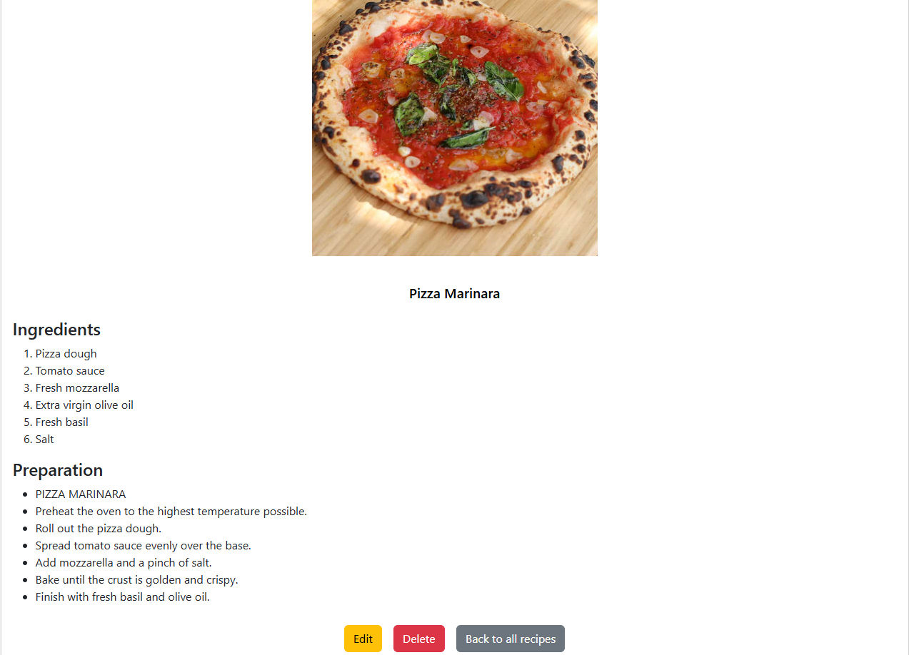

# Recipe App

Recipe App is a Django-based web application that allows users to create, manage, and explore cooking recipes.  
The project was developed as part of the CareerFoundry Full-Stack Web Development program to demonstrate core backend and frontend web development skills using Django.

---

## Features

- User authentication (login & logout)
- Create, read, update, and delete recipes (CRUD)
- Recipe search and filtering by name and category
- Protected views using authentication
- Image upload support for recipes
- Dynamic data visualization (tables and charts)
- Responsive UI with Bootstrap
- Static files handling (CSS & JavaScript)
- Informational About page

---

## Tech Stack

- **Backend:** Python, Django
- **Frontend:** Django Templates, HTML5, CSS3, Bootstrap 5
- **Database:** SQLite
- **Data Handling & Visualization:** Pandas, Matplotlib
- **Authentication:** Django built-in authentication system

---

## Project Structure

recipe_app/
└── src/
├── recipes/
│ ├── models.py
│ ├── views.py
│ ├── urls.py
│ ├── templates/
│ │ └── recipes/
│ ├── static/
│ │ └── recipes/
│ └── forms.py
├── auth/
├── manage.py

---

## Getting Started

### 1. Clone the repository

git clone https://github.com/ghostmaruko/recipe-app.git
cd recipe-app

### 2. Create and activate a virtual environment

python -m venv venv
source venv/bin/activate # On Windows: venv\Scripts\activate

### 3. Install dependencies

pip install -r requirements.txt

### 4. Apply migrations

python manage.py migrate

### 5. Create a superuser

python manage.py createsuperuser

### 6. Run the development server

python manage.py runserver

### Open your browser at:

http://127.0.0.1:8000/

### Authentication

Some views are protected and require login
Only authenticated users can create, edit, or delete recipes

GitHub: https://github.com/ghostmaruko

Portfolio: https://portfolio-ecru-theta-66.vercel.app/

📌 Notes
This project is intended for educational purposes and demonstrates best practices in Django development, including MVT architecture, authentication, and data handling.

# Screenshot

**Recipes**

